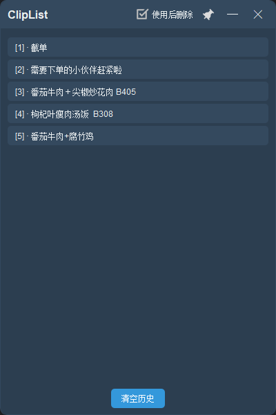

# ClipList

一个现代化的剪贴板管理工具，支持拖放操作,快捷键快速粘贴和历史记录管理。

## 功能特点

- 自动记录剪贴板历史
- 支持拖放操作
- 系统托盘集成
- 窗口置顶切换
- 使用后自动删除选项
- 现代化界面设计
- 支持 Docker 部署

## 功能说明

### 基本操作
- **复制内容**: 使用正常的 Ctrl+C，内容会自动记录到列表中
- **粘贴内容**: 两种方式
  - 拖放：直接将列表项拖到目标位置
  - 点击：点击列表项将内容复制到剪贴板，然后在目标位置使用 Ctrl+V
  - 快捷键：alt+键盘数字,即可快速粘贴栏目
- **使用后删除**: 
  - 默认开启此选项
  - 开启时，拖放或点击使用后会自动从列表中删除该项
  - 可以通过顶部的复选框切换此功能

### 界面操作
- **窗口置顶**: 点击📌图标切换窗口置顶状态
- **使用后删除**: 顶部复选框控制是否在使用后自动删除项目
- **隐藏窗口**: 按 ESC 键或点击关闭按钮
- **清空历史**: 点击底部的"清空历史"按钮
- **系统托盘**: 
  - 左键点击：显示/隐藏主窗口
  - 右键菜单：包含显示和退出选项

## 界面预览



## 开发环境

- Python 3.9+
- PyQt5 5.15.9
- Windows 10/11

## 构建和打包

### 安装打包工具
```bash
pip install pyinstaller
```

### 打包命令
```bash
# 直接使用 build.py 打包
python build.py

# 或者使用 PyInstaller 命令行
pyinstaller src/main.py --name=ClipList --windowed --onefile --icon=icons/clipboard.png --add-data="icons/clipboard.png;icons" --clean --noconfirm
```

打包后的文件位于 `dist` 目录下：
- Windows: `dist/ClipList.exe`

### 注意事项
- 确保 icons 目录下有 clipboard.png 文件
- 打包前确保已安装所有依赖 `pip install -r requirements.txt`
- 打包后的程序大小约为 30MB（经过优化）

## 依赖项

主要依赖：
- PyQt5：用于GUI界面
- pywin32：用于Windows系统集成
- keyboard：用于键盘事件处理

详细依赖请查看 `requirements.txt`

## 项目结构

```
ClipList/
├── src/
│   ├── main.py            # 程序入口
│   └── clipboard_manager.py # 主要实现
├── requirements.txt       # 项目依赖
├── Dockerfile            # Docker配置
└── README.md            # 项目文档
```

## 贡献指南

1. Fork 项目
2. 创建特性分支 (`git checkout -b feature/AmazingFeature`)
3. 提交更改 (`git commit -m 'Add some AmazingFeature'`)
4. 推送到分支 (`git push origin feature/AmazingFeature`)
5. 创建 Pull Request

## 待办事项

- [x] 添加使用后自动删除功能
- [x] 添加快捷键配置
- [ ] 支持富文本格式
- [ ] 添加搜索功能
- [ ] 支持多语言
- [ ] 添加自动更新功能

## 许可证

[MIT License](LICENSE)

## 联系方式

- 项目链接：[https://github.com/sunzeren/ClipList](https://github.com/sunzeren/ClipList)

## 致谢

感谢所有为这个项目做出贡献的开发者。
```
